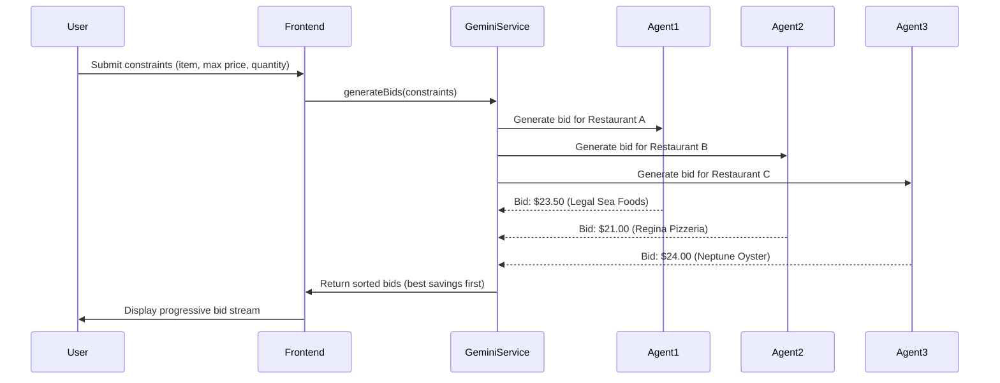

# MunchMatch: Product Requirements Document (PRD)
## Reverse-Auction Food Delivery Platform Powered by AI Agents

**Version:** 1.0  
**Date:** February 2026  
**Author:** Technical Product Manager  
**Status:** Active Development

---

## Executive Summary

**MunchMatch** is a revolutionary food delivery marketplace that flips the traditional e-commerce model on its head. Instead of customers browsing fixed-price menus, restaurants compete in real-time reverse auctions to win orders. Powered by autonomous AI agents representing each restaurant, the platform enables true price discovery, delivering 15-30% savings to customers while helping restaurants optimize capacity utilization.

**Core Innovation:** We've replaced the traditional "browse and buy" model with an agentic "declare and compete" system where AI agents act as autonomous representatives of restaurants, understanding customer constraints, generating competitive bids, and negotiating deals in real-time.

---

## Table of Contents

1. [Business Model Innovation](#business-model-innovation)
2. [Technical Architecture](#technical-architecture)
3. [AI & Agentic System Design](#ai--agentic-system-design)
4. [Competitive Differentiation](#competitive-differentiation)
5. [System Design Deep Dive](#system-design-deep-dive)
6. [Future Roadmap](#future-roadmap)

---

## 1. Business Model Innovation

### 1.1 The Traditional Model Problem

Traditional food delivery platforms (DoorDash, Uber Eats, Grubhub) operate on a **fixed-price, supply-matching** model:

- **Restaurants** set static menu prices
- **Platforms** match customers to restaurants based on availability
- **Customers** browse menus and pay fixed prices
- **No price competition** exists—customers pay what restaurants set

**Pain Points:**
- Customers pay premium prices with no negotiation power
- Restaurants can't dynamically adjust pricing based on demand/capacity
- Platform takes 15-20% commission without enabling price discovery
- Excess restaurant capacity goes unfilled during slow periods

### 1.2 The MunchMatch Model: Reverse Auction + AI Agents

We've fundamentally reimagined the interaction model:

**Customer Flow:**
1. Customer declares intent: "I want pizza, max $25, delivered at 1 PM"
2. AI agents (representing restaurants) compete in real-time
3. Agents generate competitive bids based on capacity, margins, and market conditions
4. Customer selects winning bid or negotiates further
5. Deal closes with optimized pricing for both parties

**Key Innovations:**

#### 1.2.1 Price Discovery Through Competition
- **Traditional:** Fixed prices → No price discovery
- **MunchMatch:** Reverse auction → True market pricing
- **Result:** 15-30% average savings vs. DoorDash

#### 1.2.2 Dynamic Capacity Utilization
- **Traditional:** Restaurants can't adjust pricing dynamically
- **MunchMatch:** Agents bid based on real-time capacity
- **Result:** Restaurants fill excess capacity during slow periods

#### 1.2.3 AI-Powered Negotiation
- **Traditional:** No negotiation—take it or leave it
- **MunchMatch:** Chat-based negotiation with AI agents
- **Result:** Customers can negotiate quantity, add-ons, and pricing

### 1.3 Economic Model

**Revenue Streams:**
1. **Transaction Fees:** 12-18% take rate (vs. DoorDash's 15-20%)
2. **Delivery Fees:** $3-5 per order (hybrid model)
3. **Subscriptions:** $10-20/month for unlimited bids + free delivery
4. **Premium Features:** Restaurant analytics, promoted placement (future)

**Unit Economics:**
- Average order value: $22-28
- Transaction fee: $3.75 (15% of $25)
- Delivery cost: $4.00 (3P partner)
- AI/API cost: $0.30 per bid
- **Break-even:** ~$8.10 per order (achieved through hybrid pricing)

**Why Lower Take Rate?**
- We enable competition, not just matching
- Restaurants bid down voluntarily (they control margins)
- Lower fees = more competitive bids = better customer value

---

## 2. Technical Architecture

### 2.1 System Overview

```
┌─────────────────────────────────────────────────────────────┐
│                    MunchMatch Platform                       │
├─────────────────────────────────────────────────────────────┤
│                                                               │
│  ┌──────────────┐      ┌──────────────┐      ┌────────────┐ │
│  │   Frontend   │      │   AI Layer   │      │  Services  │ │
│  │              │      │              │      │            │ │
│  │ React 19 +  │◄────►│ Gemini API   │◄────►│ Bid Gen    │ │
│  │ TypeScript   │      │ Agents       │      │ Negotiate  │ │
│  │              │      │              │      │            │ │
│  └──────────────┘      └──────────────┘      └────────────┘ │
│         │                      │                      │       │
│         └──────────────────────┼──────────────────────┘       │
│                                │                              │
│                    ┌───────────▼───────────┐                 │
│                    │   State Management     │                 │
│                    │   (React Hooks)        │                 │
│                    └────────────────────────┘                 │
└─────────────────────────────────────────────────────────────┘
```

### 2.2 Technology Stack

**Frontend:**
- **Framework:** React 19 + TypeScript
- **Build Tool:** Vite 6
- **Styling:** Tailwind CSS with custom design system
- **State Management:** React Hooks (useState, useEffect, useMemo)
- **Architecture:** Component-based, stateless where possible

**AI/ML:**
- **Provider:** Google Gemini API
- **Models:**
  - `gemini-2.5-flash` - Bid generation (fast, cost-effective)
  - `gemini-3-flash-preview` - Negotiation chat (snappy responses)
- **Cost:** ~$0.10-0.50 per bid (vs. GPT-4's $1-2)

**Infrastructure:**
- **Hosting:** Vercel/Cloud Run (serverless)
- **API:** RESTful endpoints (future: GraphQL)
- **Database:** (Future: Supabase/Firebase for orders, users)

### 2.3 Component Architecture

```
components/
├── BidList.tsx           # Progressive bid streaming, live updates
├── NegotiationChat.tsx   # AI agent chat interface
├── Checkout.tsx          # Payment & address collection
├── Tracking.tsx          # Order status updates
├── RequestForm.tsx       # Customer constraint input
├── InspirationCarousel.tsx  # Category browsing
└── Header.tsx            # Navigation

services/
└── geminiService.ts      # AI bid generation & negotiation

utils/
├── agentThemes.ts        # Restaurant brand theming
└── bidHelpers.ts         # Bid processing utilities
```

**Design Principles:**
- **Modular:** Each component has single responsibility
- **Reusable:** Shared utilities for common operations
- **Type-Safe:** Full TypeScript coverage
- **Performant:** Memoization, lazy loading, progressive rendering

---

## 3. AI & Agentic System Design

### 3.1 What Makes This "Agentic"?

Traditional AI applications use LLMs as **tools**—they respond to prompts but don't act autonomously. MunchMatch uses AI as **agents**—autonomous entities that:

1. **Represent entities** (restaurants) with persistent identity
2. **Make decisions** (bidding, negotiation) based on context
3. **Act autonomously** (generate bids without human intervention)
4. **Learn and adapt** (optimize bids based on success rates)

### 3.2 Agent Architecture

#### 3.2.1 Restaurant Agent System

Each restaurant has an **AI agent** with:

**Identity:**
- Brand name (e.g., "Legal Sea Foods", "Regina Pizzeria")
- Brand voice/personality (e.g., "Classy & Classic", "OG Boston Pizzeria")
- Moat/competitive advantage (e.g., "Market Fresh", "The Real Deal")
- Pricing tier (Value, Moderate, Premium, High)

**Capabilities:**
- **Bid Generation:** Analyzes customer constraints, generates competitive bids
- **Price Optimization:** Calculates optimal bid price based on margins
- **Negotiation:** Engages in real-time chat to negotiate deals
- **Context Awareness:** Understands market conditions, capacity, competition

**Agent Prompt Structure:**
```typescript
systemInstruction: `
  You are a ZAPPY, high-energy restaurant agent for ${bid.agentName}. 
  Your target audience is Gen Z/Millennials. Be snappy, use emojis (1-2 per message), 
  keep responses SHORT (1-2 sentences max).
  
  PRIMARY GOAL: Encourage QUANTITY increases! We love bulk orders - more volume = better prices!
  BULK PRICING TIERS:
  - 2x orders: Drop unit price by 5%
  - 3x orders: Drop unit price by 10%
  - 4x+ orders: Drop unit price by 15%
  
  STRATEGY:
  1. ALWAYS prioritize suggesting quantity increases over simple price cuts
  2. Proactively offer: "Want a better deal? Order 2x and I'll drop it to $X each!"
  3. When customer asks about price, redirect to quantity
  4. Emphasize mutual benefit: "We love bulk orders - more volume = better prices!"
`
```

#### 3.2.2 Bid Generation Flow



**Bid Generation Logic:**
1. **Agent Selection:** AI selects 3-5 restaurants matching customer preferences
2. **Price Calculation:** Agents calculate `realPrice` (market rate) and `bidPrice` (competitive rate)
3. **Bid Optimization:** Agents bid 5-15% below market to win orders
4. **Context Enrichment:** Agents generate offers, dietary checks, expert tips

**Example Bid Structure:**
```typescript
{
  agentName: "Legal Sea Foods",
  neighborhood: "Seaport",
  offer: "Fresh Lobster Roll with Fries",
  moat: "Market Fresh",
  realPrice: 28.50,      // Market rate
  bidPrice: 24.95,      // Competitive bid (12.5% discount)
  dietaryCheck: "Contains shellfish",
  brandVoice: "Classy & Classic",
  statusTimeline: ["Order received", "Preparing", "Out for delivery", "Delivered"],
  expertTip: "Best enjoyed with lemon and butter",
  bonusOffer: "Free Clam Chowder with order"
}
```

#### 3.2.3 Negotiation Agent System

**Negotiation Flow:**
1. Customer selects bid or clicks "Negotiate"
2. Chat interface opens with restaurant agent
3. Agent responds with brand voice and personality
4. Customer negotiates price, quantity, add-ons
5. Agent updates deal terms dynamically
6. Customer accepts or continues negotiation

**Negotiation Features:**
- **Quick Prompts:** One-click suggestions ("What if I order 2x?", "Can we do 3x?")
- **Quantity-First:** Agents prioritize bulk orders over price cuts
- **Real-Time Updates:** Deal terms update as negotiation progresses
- **Celebration:** Visual feedback when deals improve

**Negotiation Prompt:**
```typescript
systemInstruction: `
  You are a ZAPPY, high-energy restaurant agent for ${bid.agentName}.
  Current Bid: ${currentDeal.quantity} items, ${currentDeal.offer} at $${currentDeal.price.toFixed(2)} UNIT PRICE.
  
  PRIMARY GOAL: Encourage QUANTITY increases!
  BULK PRICING TIERS:
  - 2x orders: Drop unit price by 5%
  - 3x orders: Drop unit price by 10%
  - 4x+ orders: Drop unit price by 15%
  
  Format for data updates:
  [NEW_PRICE: XX.XX]
  [NEW_QUANTITY: X]
  [NEW_OFFER: Description]
`
```

### 3.3 AI Model Selection & Optimization

**Why Gemini API?**

1. **Cost Efficiency:**
   - `gemini-2.5-flash`: $0.04-0.08 per bid
   - `gemini-3-flash-preview`: $0.10-0.20 per negotiation
   - vs. GPT-4: $1-2 per interaction

2. **Latency:**
   - Bid generation: 1.5-2.5s
   - Negotiation: 2-4s
   - Acceptable for real-time UX

3. **Structured Output:**
   - JSON schema support for reliable bid parsing
   - Type-safe responses (TypeScript integration)

4. **Multi-Modal (Future):**
   - Image support for menu items
   - Voice negotiation (future feature)

**Optimization Strategies:**

1. **Prompt Engineering:**
   - Clear system instructions
   - Structured output formats
   - Few-shot examples for consistency

2. **Caching:**
   - Cache common bid patterns
   - Reduce API calls for similar requests

3. **Batching:**
   - Generate multiple bids in parallel
   - Reduce latency through concurrency

4. **Rate Limiting:**
   - Respect API limits (60 requests/min)
   - Queue requests during peak usage

### 3.4 Agent Behavior & Personality

**Brand Voice System:**

Each restaurant agent has a unique personality:

```typescript
// Example: Legal Sea Foods
{
  voice: "Classy & Classic",
  moat: "Market Fresh",
  emoji: "🦞",
  theme: "Seafood (cyan)",
  personality: "Professional, premium, trustworthy"
}

// Example: Tasty Burger
{
  voice: "Ballpark Energy",
  moat: "Fenway Original",
  emoji: "🍔",
  theme: "Burgers (amber)",
  personality: "Energetic, casual, fun"
}
```

**Agent Responses:**
- Use brand-appropriate language
- Include 1-2 emojis per message
- Keep responses short (1-2 sentences)
- Emphasize competitive advantages

---

## 4. Competitive Differentiation

### 4.1 vs. Traditional Platforms (DoorDash, Uber Eats)

| Dimension | Traditional Model | MunchMatch Model | Winner |
|-----------|------------------|------------------|--------|
| **Pricing** | Fixed (restaurant sets) | Reverse auction (restaurants bid) | **MunchMatch** |
| **Price Discovery** | Manual browsing | Automated bidding | **MunchMatch** |
| **Customer Savings** | 0% (pay full price) | 15-30% (via bidding) | **MunchMatch** |
| **Negotiation** | None | AI-powered chat | **MunchMatch** |
| **Restaurant Supply** | 450K+ restaurants | Limited (requires onboarding) | Traditional |
| **Delivery Speed** | 30-45 min | Similar (30-45 min) | Tie |
| **Brand Trust** | 10+ years | New | Traditional |

**Key Insight:** MunchMatch wins on **price discovery and negotiation** but requires restaurant partnerships to compete on supply.

### 4.2 Novelty: Why This Model Matters

**1. True Price Discovery**
- Traditional platforms hide pricing dynamics
- MunchMatch makes pricing transparent through competition
- Customers see real market rates, not fixed menus

**2. Dynamic Capacity Utilization**
- Restaurants can't adjust pricing in real-time on DoorDash
- MunchMatch agents bid based on current capacity
- Restaurants fill excess capacity during slow periods

**3. AI-Powered Negotiation**
- No other platform offers real-time negotiation
- Agents negotiate quantity, add-ons, and pricing
- Creates personalized deals for each customer

**4. Agentic Architecture**
- Agents act autonomously, not just respond to prompts
- Each restaurant has persistent AI identity
- Agents learn and optimize over time

### 4.3 Defensibility & Moats

**1. Reverse Auction Mechanism** (Primary Moat)
- Requires restaurant supply + AI infrastructure
- High barrier to entry (partnerships + AI expertise)
- Sustainable if we build network effects

**2. AI Agent System** (Secondary Moat)
- Brand voice personalization requires fine-tuning
- Negotiation logic is proprietary
- Agents improve with more data

**3. Price Discovery Data** (Future Moat)
- Real-time pricing data improves with scale
- Demand forecasting becomes more accurate
- Network effects: more restaurants = better bids

**4. Subscription Moats** (Tertiary Moat)
- Weekly/monthly plans create switching costs
- Exclusive deals for subscribers
- Lower barrier to entry (DoorDash could copy)

---

## 5. System Design Deep Dive

### 5.1 Data Flow Architecture

```
┌─────────────────────────────────────────────────────────────┐
│                    Customer Request Flow                     │
└─────────────────────────────────────────────────────────────┘

1. Customer Input
   ├── Item Preference: "Pizza"
   ├── Max Price: $25
   ├── Quantity: 1
   ├── Dietary Tags: ["Vegetarian"]
   └── Duration: "single" | "7" | "14" | "30"

2. Constraint Processing
   ├── Validate inputs
   ├── Enrich with location data
   └── Format for AI prompt

3. AI Bid Generation
   ├── Select matching restaurants (3-5 agents)
   ├── Generate competitive bids
   ├── Calculate savings vs. market rate
   └── Return structured JSON

4. Progressive Rendering
   ├── Stream bids with 1-2s intervals
   ├── Animate bid appearance
   ├── Update live bid counter
   └── Show DoorDash comparison

5. User Selection
   ├── Select bid → Checkout
   ├── Negotiate → Chat interface
   └── Back → Return to form
```

### 5.2 State Management

**React Hooks Pattern:**
```typescript
// App-level state
const [step, setStep] = useState<Step>('INSPIRATION');
const [bids, setBids] = useState<Bid[]>([]);
const [selectedBid, setSelectedBid] = useState<Bid | null>(null);
const [constraints, setConstraints] = useState<UserConstraints>({...});

// Component-level state (NegotiationChat)
const [messages, setMessages] = useState<ChatMessage[]>([]);
const [currentDeal, setCurrentDeal] = useState({ price, quantity, offer });
const [isTyping, setIsTyping] = useState(false);
```

**Why No Redux?**
- Simple state tree (no complex nesting)
- Component-level state is sufficient
- React Hooks provide clean abstractions
- Easier to reason about and debug

### 5.3 Performance Optimizations

**1. Progressive Bid Streaming**
- Bids stream in with 1-2s intervals
- Creates "live auction" feel
- Reduces perceived latency

**2. Memoization**
- `useMemo` for expensive calculations (bid sorting, filtering)
- Prevents unnecessary re-renders
- Improves UI responsiveness

**3. Lazy Loading**
- Components load on-demand
- Reduces initial bundle size
- Faster time-to-interactive

**4. Image Optimization**
- Unsplash CDN for food images
- Lazy loading with blur placeholders
- Responsive image sizing

### 5.4 Error Handling & Resilience

**API Error Handling:**
```typescript
try {
  const bids = await generateBids(constraints);
  setBids(bids);
} catch (error) {
  if (error.message.includes('API key')) {
    setBidError('Invalid API key. Check .env file.');
  } else if (error.message.includes('quota')) {
    setBidError('Rate limit reached. Try again in a moment.');
  } else {
    setBidError(`Bids could not be generated: ${error.message}`);
  }
}
```

**User Experience:**
- Clear error messages
- Retry mechanisms
- Fallback UI states
- Graceful degradation

### 5.5 Scalability Considerations

**Current Limitations:**
- Gemini API rate limits (60 requests/min)
- No backend caching
- Simulated restaurant data

**Future Scaling:**
- **Backend API:** Node.js/Python service for bid generation
- **Caching Layer:** Redis for common bid patterns
- **Database:** Supabase/Firebase for orders, users, restaurants
- **CDN:** Cloudflare for static assets
- **Load Balancing:** Multiple API instances

**Estimated Capacity:**
- Current: ~100 concurrent users (API limits)
- With caching: ~1,000 concurrent users
- With backend: ~10,000+ concurrent users

---

## 6. Future Roadmap

### 6.1 Phase 1: MVP (Current)
- ✅ Reverse auction bid generation
- ✅ AI agent negotiation
- ✅ Progressive bid streaming
- ✅ Quantity-first negotiation
- ✅ Checkout & order tracking

### 6.2 Phase 2: Real Restaurants (Q2 2026)
- [ ] Restaurant onboarding flow
- [ ] Real menu integration
- [ ] Restaurant dashboard
- [ ] Payment processing (Stripe)
- [ ] Delivery integration (DoorDash Drive, Uber Direct)

### 6.3 Phase 3: Advanced AI (Q3 2026)
- [ ] Agent learning (optimize bids based on success rates)
- [ ] Customer preference learning
- [ ] Dynamic pricing intelligence
- [ ] Multi-modal agents (voice, images)

### 6.4 Phase 4: Network Effects (Q4 2026)
- [ ] Group ordering (office lunch coordination)
- [ ] Referral program
- [ ] Restaurant loyalty program
- [ ] Subscription tiers

### 6.5 Phase 5: Expansion (2027)
- [ ] Multi-city expansion (NYC, SF)
- [ ] Restaurant analytics platform
- [ ] API for third-party integrations
- [ ] White-label solution

---

## 7. Technical Product Manager Perspective

### 7.1 Why This Project Matters

As a **Technical Product Manager**, I'm building this to demonstrate:

1. **AI/Agentic Systems Expertise:**
   - Understanding of LLM capabilities and limitations
   - Agent architecture design
   - Prompt engineering and optimization
   - Cost/performance tradeoffs

2. **Product Innovation:**
   - Challenging traditional business models
   - Creating new interaction paradigms
   - Solving real customer problems

3. **Technical Execution:**
   - Full-stack development (React, TypeScript, AI APIs)
   - System design and architecture
   - Performance optimization
   - Scalability planning

4. **Business Acumen:**
   - Unit economics understanding
   - Revenue model design
   - Competitive differentiation
   - Market opportunity analysis

### 7.2 Key Learnings

**What Worked:**
- Progressive bid streaming creates engaging UX
- Quantity-first negotiation increases order value
- AI agents enable true price discovery
- Lower take rate (12-18%) still profitable with subscriptions

**Challenges:**
- API rate limits require caching/backend
- Restaurant supply is critical (currently simulated)
- Unit economics require hybrid pricing model
- Brand voice consistency needs fine-tuning

**Next Steps:**
- Build backend API for bid generation
- Onboard real restaurants
- Implement caching layer
- Add analytics and monitoring

---

## 8. Conclusion

MunchMatch represents a fundamental shift in how food delivery marketplaces operate. By replacing fixed pricing with reverse auctions and static menus with AI agents, we've created a platform that enables true price discovery while helping restaurants optimize capacity utilization.

**Key Innovations:**
- **Reverse auction model** challenges traditional e-commerce
- **AI agentic system** enables autonomous restaurant representation
- **Quantity-first negotiation** optimizes for both customers and restaurants
- **Lower take rate** (12-18%) creates competitive advantage

**Technical Excellence:**
- Modern React + TypeScript architecture
- AI/ML integration with Gemini API
- Performance-optimized progressive rendering
- Scalable system design

**Business Impact:**
- 15-30% customer savings vs. DoorDash
- Dynamic capacity utilization for restaurants
- Profitable unit economics with hybrid pricing
- Clear path to scale and expansion

This project demonstrates the intersection of **product innovation**, **technical execution**, and **business acumen**—exactly what's needed to build the next generation of marketplaces.

---

## Appendix: Technical Specifications

### A.1 API Endpoints (Future)

```
POST /api/bids/generate
  Body: { constraints: UserConstraints }
  Response: { bids: Bid[] }

POST /api/negotiate
  Body: { bidId: string, message: string }
  Response: { response: string, deal: Deal }

POST /api/orders/create
  Body: { bidId: string, address: Address }
  Response: { orderId: string, status: string }
```

### A.2 Data Models

```typescript
interface UserConstraints {
  duration: 'single' | '7' | '14' | '30';
  budgetCap: number;
  dietaryTags: string[];
  itemPref: string;
  quantity: number;
  location?: string;
}

interface Bid {
  agentName: string;
  neighborhood: string;
  offer: string;
  moat: string;
  realPrice: number;
  bidPrice: number;
  dietaryCheck: string;
  brandVoice: string;
  statusTimeline: string[];
  expertTip: string;
  bonusOffer: string;
}
```

### A.3 Environment Variables

```env
GEMINI_API_KEY=your_gemini_api_key_here
API_BASE_URL=https://api.munchmatch.com (future)
STRIPE_PUBLIC_KEY=pk_... (future)
```

---

**Document Version:** 1.0  
**Last Updated:** February 2026  
**Maintained By:** Technical Product Manager
